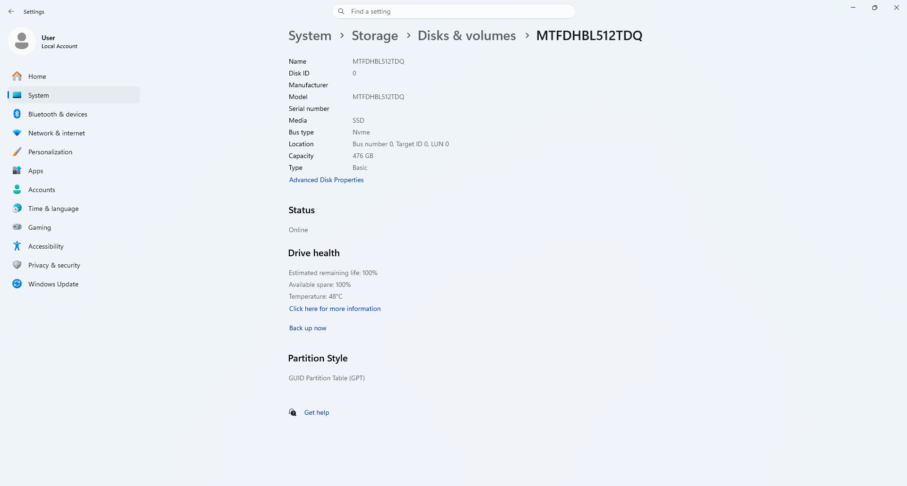
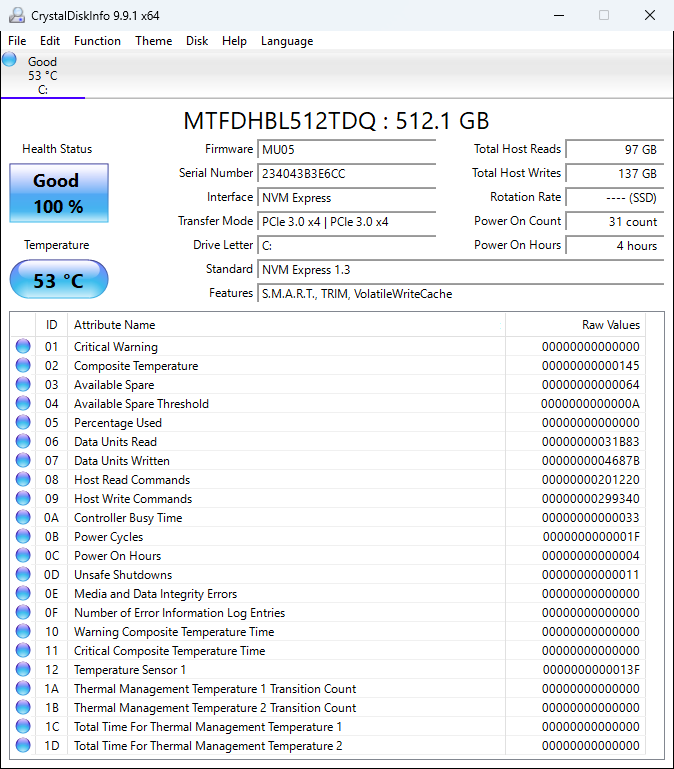
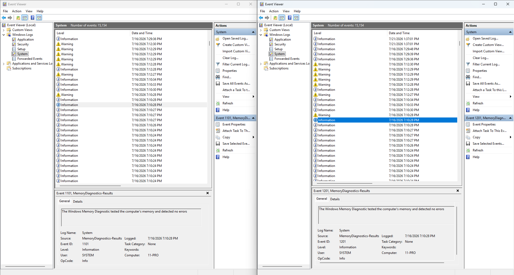

Today marks the first journal entry for my homelab journey!

These journal entries most likely wont be a daily thing and will only serve as an outlet for whenever I want to express my opinions and thoughts about anything homelab related so that I can look back from the future from a less formal perspective compared to the SDLC docs and get a better understanding of my thought processes and what I was thinking about at the time. I will also be documenting my progress in these.

Currently, I have my Lenovo ThinkCentre m920q with an i5-8600T, 32GB RAM, and a 512GB SSD. This is the initial PC I plan to use for my homelab for now and it should suffice for my use cases. If I end up needing more compute power, I can always upgrade my hardware or purchase another ThinkCentre to help support the workload.

Extensive hardware health checks have been run and I've verified system specifications using Windows' built-in tools and CrystalDiskInfo. I may run performance stress tests on the components sometime later.

Everything in this repo will also be committed directly through main and not through a separate branch before being merged 🙀🙀🙀 Big software dev nono

While I wait for other components to arrive, I'll start by documenting my initial homelab plans. I'm going to document this homelab journey using a format that closely resembles the Software Development Life Cycle because it pretty much entails everything that should be documented in a system design process and it's the most structured process that I'm familiar with.
