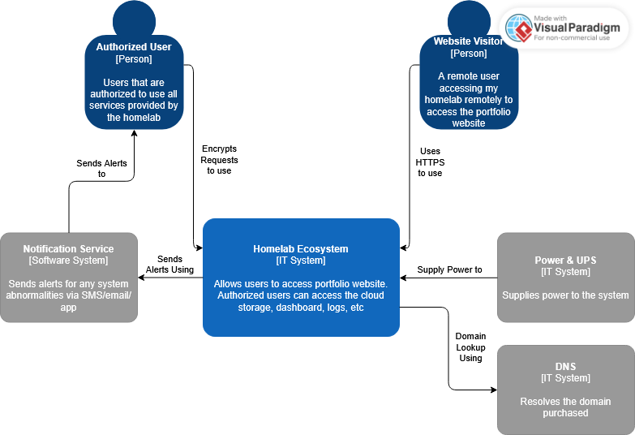

# 3.0 - Design

_The purpose of this section is to satisfy and elaborate on the requirements mentioned in the requirements analysis_

## 3.1 - General Architecture

### 3.1.1 - C4 Diagram

<ins>Context diagram</ins>

<ins>Container diagram</ins>

<ins>Component diagram</ins>

## 3.2 - Hardware Design

- Lenovo ThinkCentre m920q: Hypervisor host
- 512GB SSD: Proxmox installation and VM boot disks
- 32GB RAM: Memory required to host services
- DAS: Storage bay
- SATA HDDs: Cloud storage
- UPS: Power protection and reliability
- 2.5 GbE NIC: Faster LAN throughput
- Ethernet cable: Proxmox support and provide faster, more stable LAN throughput
- ThinkCentre PCIe adapter: x16 PCIe slot addon for expansion cards
- Display monitor: Display for metrics and analytics dashboard
- 8Gb+ USB: Flash Proxmox

> [!IMPORTANT]
>
> ### An update to Hardware Design
>
> _These changes to the hardware design have been made since the making of this document_
>
> - Lenovo ThinkCentre m920q: Hypervisor host
> - 512GB SSD: Proxmox installation and VM boot disks
> - 32GB RAM: Memory required to host services
> - ThinkCentre PCIe adapter: x16 PCIe slot addon for expansion cards
> - Ethernet cable: Proxmox support and provide faster, more stable LAN throughput
> - UPS: Power protection and reliability
> - Display monitor: Display for metrics and analytics dashboard
> - 8gb+ bootable USB: Flash Proxmox
> - SAS HBA card flashed into IT mode: Storage controller expansion card for SAS drives
> - x16 PCIe extension ribbon: Extend the HBA card outside of ThinkCentre enclosure. May not be needed
> - SFF-8087 to 4x SFF-8482 + 4x SATA power breakout cable: Splitting connections amongst SAS HDDs, PSU, and HBA card
> - 40mm fan: HBA card cooler
> - 80mm fan: HDD cooler
> - AC-to-DC PSU with minimum 5 SATA ports: HDD fan and HDD cooler
> - PWM controller: HDD fan remote
> - 4 SAS HDD's: Cloud, RAID, and backup storage

Physical infrastructure diagram

## 3.3 - Storage Design

NVMe SSD (in the ThinkCentre)

- Proxmox
- VM disks
- ISO images
- Containers

External DAS

- Cloud storage
- RAID pool
- Backups
- Logs

Storage architecture diagram

## 3.4 - Network Design

Network topology diagram

## 3.5 - VM Designs

## 3.6 - Security Design

## 3.7 - Backup and Recovery Design

## 3.8 - Analytics and Monitoring Design

Hardware metrics should be constantly monitored for abnormalities and disaster prevention. Some of these metrics may be monitored in the form of a graph to improve readability.
Some of these metrics may include:

- CPU utilization and temperature
- RAM utilization
- Readable SMART data (likely abstracted)
- Network utilization
- HDD and VM state
- Storage capacities and temperatures (for both ThinkCentre and DAS)
- UPS battery state
  Display these metrics on the dashboard's default screen.

If any abnormalities are found, notifications will be sent through email and/or app

## 3.9 - Scalability

This system is designed to be scalable if more compute resources or functionalities are needed

- HDDs can be upgraded for more cloud storage
- VMs abstract each function, allowing for the addition of more VMs for future functionalities
- RAM and can be upgraded to higher capacities
- VM boot disk storage can be upgraded via higher capacity NVMe SSDs
- Additional ThinkCentres can be purchased to support the workload
