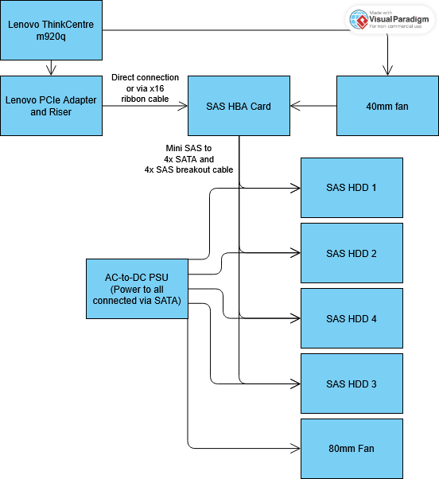

# 3.0 - Design

_The purpose of this section is to satisfy and elaborate on the requirements mentioned in the requirements analysis_

## 3.1 - General Architecture

The system consists of a single-node virtualization platform (Proxmox VE) hosting a set of isolated VMs and LXC containers, each responsible for one function. In the absence of a VLAN-capable switch, network segmentation is achieved logically through the Proxmox firewall (datacenter, node, and guest levels), strict per-guest IP/port allow-listing, and a Tailscale-based zero-trust overlay network for remote access. Public-facing traffic reaches the platform exclusively through an outbound-only Cloudflare Tunnel, so no inbound ports are ever opened on the home router.

## 3.2 - Hardware Design

- Lenovo ThinkCentre m920q: Hypervisor host
- 512GB SSD: Proxmox installation and VM boot disks
- 32GB RAM: Memory required to host services
- ThinkCentre PCIe adapter: x16 PCIe slot addon for expansion cards
- Ethernet cable: Proxmox support and provide faster, more stable LAN throughput
- UPS: Power protection and reliability
- Display monitor: Display for metrics and analytics dashboard
- 8gb+ bootable USB: Flash Proxmox
- SAS HBA card flashed into IT mode: Storage controller expansion card for SAS drives
- x16 PCIe extension ribbon: Extend the HBA card outside of ThinkCentre enclosure. May not be needed
- SFF-8087 to 4x SFF-8482 + 4x SATA power breakout cable: Splitting connections amongst SAS HDDs, PSU, and HBA card
- 40mm fan: HBA card cooler
- 80mm fan: HDD cooler
- AC-to-DC PSU with minimum 5 SATA ports: HDD fan and HDD cooler
- PWM controller: HDD fan remote
- 4 SAS HDD's: Cloud, RAID, and backup storage

## 3.3 - Storage Design

Storage is split between the internal NVMe boot disk and an external JBOD of four SAS drives, attached via the HBA in IT mode (pass-through, no hardware RAID).

NVMe SSD (in the ThinkCentre)

- Proxmox
- VM disks
- ISO images
- Containers

JBOD

The four drives are pooled into a single ZFS pool named tank, configured as RAID Z2 (dual-parity), tolerating up to two simultaneous drive failures without data loss. Pool created with ashift=12, lz4 compression, atime disabled, and POSIX ACLs enabled.

ZFS ARC is capped (rather than left at the ~50% default) to avoid starving guest memory on a 32GB host. Monthly scrubs and staggered SMART short/long self-tests are scheduled via cron and an overview of results are displayed on the dashboard.

| Dataset | Purpose |
| -------- | -------- |
| tank/vm-storage | VM virtual disks |
| tank/lxc-storage | LXC mounted volumes |
| tank/nextcloud-data | Nextcloud bulk storage |
| tank/minecraft | Minecraft world and server data |
| tank/backups | Proxmox backup targets |
| tank/logs | Monitoring LXC disk (Prometheus/Loki data) |

<ins>Storage Infrastructure Diagram</ins>

## 3.4 - VM/LXC Designs

Each service runs in its own dedicated guest to keep functions isolated and independent. Static IP addressing is used throughout, incrementing by 10 per guest on the 10.0.0.0/24 LAN.

| Hostname | IP | Type | Function |
| -------- | -------- | -------- | -------- |
| Tailscale | 10.0.0.10 | LXC | Tailscale Subnet Router |
| caddy-tunnel | 10.0.0.20 | LXC | Reverse proxy + Cloudflare tunnel |
| Portfolio-site | 10.0.0.30 | LXC | nginx, pulls data client-side from API |
| Nextcloud | 10.0.0.40 | VM | Nextcloud AIO Docker container for personal cloud storage |
| Minecraft | 10.0.0.50 | LXC | Vanilla server shared to external users via Tailscale node sharing |
| Monitoring | 10.0.0.60 | LXC | Prometheus, Grafana, Loki, and collectors |
| Windows-AD | 10.0.0.70 | VM | Windows AD practice |

VMs are reserved for services that require stronger kernel-level isolation or require a different OS from Linux; all other services run as unprivileged LXCs to minimize resource overhead.

## 3.5 - Security Design
In the absence of VLAN-capable switching, security is layered entirely through software controls at the hypervisor, guest, and overlay-network levels rather than physical network segmentation.

<ins> Firewall (3 layers) </ins>
 - Datacenter level: Default DROP policy on all input and only allow explicitly allow-listed traffic 
 - Node level: Proxmox UI (8006) and SSH (22) connections restricted to LAN subnet and the Tailscale CGNAT range (100.64.0.0/10)
 - Guest level: Every VM/LXC has their own firewalls enabled with a default DROP policy. SSH only via LAN subnet and Tailscale range. Per-service rules are scoped to the minimum required source.

<ins> Zero-Trust Remote Access (Tailscale) </ins>
 - Tailscale replaces VLAN-based segmentation for remote access. All devices must be authenticated Tailnet members to reach any service.
 - Node sharing is used for the Minecraft server specifically so that access can be granted to that single LXC without exposing services on the rest of the Tailnet.

<ins> Cloudflare Tunnel </ins>
 - The only service reachable from the public internet is the static website, and only via an outbound-only Cloudflare Tunnel terminating at the Caddy LXC. No ports are ever forwarded on the home router, and the tunnel's connector initiates all connections outbound, so there is no listening public port to attack.

<ins> Host and Credentials </ins>
 - SSH on the Proxmox host uses key-based authentication only; password authentication is disabled.
 - Containers run unprivileged by default. The Minecraft LXC in particular runs unprivileged despite being internet-adjacent via Tailscale sharing, limiting the blast radius of a container-level compromise.

## 3.6 - Backup and Recovery Design
Backups are structured in two layers - ZFS snapshots for fast, low-overhead point-in-time recovery, and Proxmox's native backup (vzdump) for full VM/LXC image-level recovery - targeting the dedicated tank/backups dataset on the RAIDZ2 pool.

<ins> ZFS snapshots </ins>
Scheduled snapshots on tank/nextcloud-data and tank/minecraft provide fast rollback for accidental deletion or corruption without needing a full VM/LXC restore. Snapshots are retained on a rotating schedule.

<ins> Proxmox backup jobs (vzdump) </ins>
Scheduled backup jobs cover every VM and LXC, writing to tank/backups, providing full-image recovery in the event of guest-level failure (corrupted OS disk, failed upgrades) rather than just data loss.
Retention is capped to 3 backups per guest.

<ins> Monitoring integration </ins>
Backup job success/failure and duration are displayed in Grafana (Section 3.7) so a failed backup is caught proactively rather than discovered only at restore time.

<ins> Recovery validation </ins>
Periodic test restores (of at least one VM/LXC and one ZFS snapshot) are performed to confirm backups are actually restorable, rather than assuming success from job logs alone.

</ins> Off-site consideration </ins>
All backups above reside on the same physical pool (tank) as the production data. RAIDZ2 protects against drive failure but not against a pool-level loss (multiple simultaneous failures beyond parity, theft, fire). An off-site or off-host copy of tank/backups is a known gap and a candidate for future scaling rather than part of the current implementation.

## 3.7 - Analytics and Monitoring Design

Hardware and service metrics are monitored continuously to catch abnormalities before they cause data loss or downtime. The stack is built on Prometheus (metrics), Loki (logs), Grafana Alloy (collection/shipping agent on every guest and the host), and Grafana (visualization/alerting).

 - CPU utilization and temperature - collected via Alloy's exporter and hwmon sensors on the host.
 - RAM utilization - collected per guest via Alloy's exporter.
 - Readable SMART data - collected via smartctl_exporter on the host; raw attributes are abstracted into simplified pass/fail and last-self-test panels rather than shown as raw output on the main screen.
 - Network utilization - throughput, errors, and drops via Alloy's exporter.
 - HDD and VM/LXC state - ZFS pool health via zfs_exporter; guest up/down and uptime via pve_exporter against the Proxmox API.
 - Storage capacities and temperatures (ThinkCentre and DAS) - ZFS pool capacity via zfs_exporter, NVMe/CPU temps via hwmon, and SAS drive temps via SMART, since spinning SAS drives are not exposed through hwmon.
 - UPS battery state - to be integrated via NUT (Network UPS Tools) exporter.

## 3.8 - Scalability

This system is designed to be scalable if more compute resources or functionalities are needed

- HDDs can be upgraded for more cloud storage
- VMs abstract each function, allowing for the addition of more VMs for future functionalities
- RAM and can be upgraded to higher capacities
- VM boot disk storage can be upgraded via higher capacity NVMe SSDs
- Additional ThinkCentres can be purchased to support the workload
- Offsite backup for tank data
